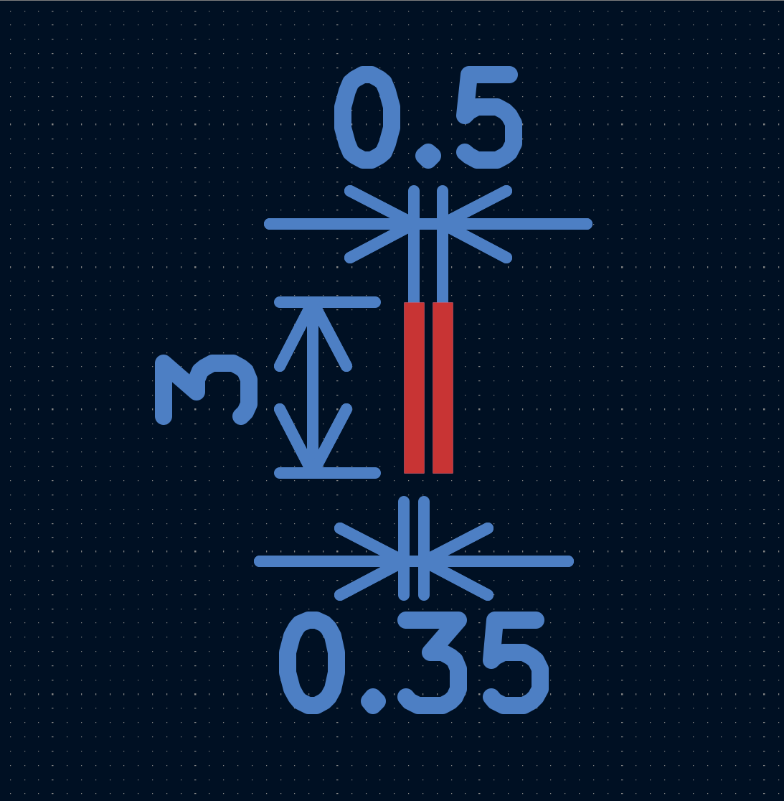

# Footprints Guide for Soldered FPC

While the exact footprint for your display may vary, the following guidelines seems to be the most common for soldered FPC displays that I have tested.

The soldered FPC displays need longer pads than the FPC connector uses, this is to allow for proper heating and solder reflow to the PCB.
This may be changed if this is not suited for your needs, but the values below have worked in my PCB designs so far.

Most important tip is to keep track of the pinout!
It is very easy to accidentally flip the footprint and not realize it until you accidentally burn the display.
A good way to test this is to simply print the entire PCB design on paper before sending it to the manufacturer.
That way you can lay the LCD directly onto the piece of paper and verify that the pinout is correct!

## 0.5mm Pitch

Notes:
- PCBWay does not support solder mask between the pads in their affordable PCB service. Other manufacturers like Aisler and JLCPCB doesn't seem to care.

## 0.7mm Pitch

