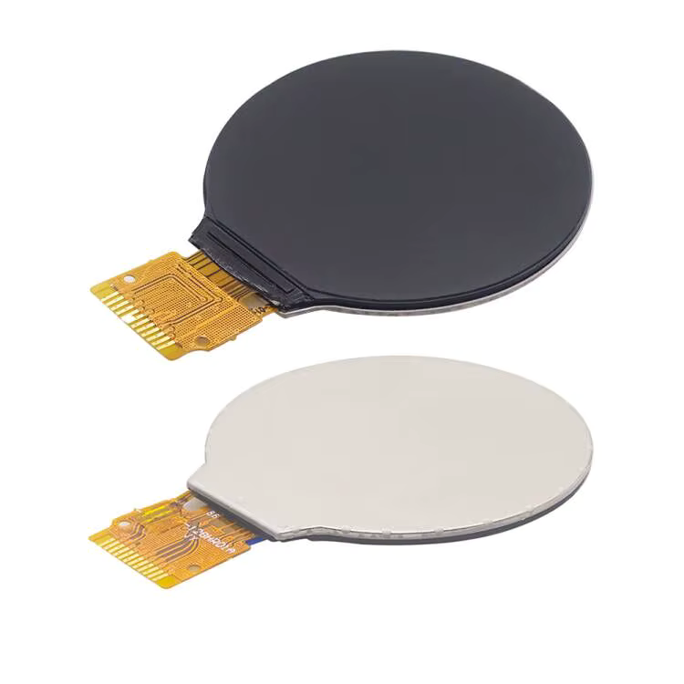

# GC9A01 12-Pin 1-bit SPI Display Pinout

Despite the name of the SPI pins being similar to how I2C is conventionally named, this display uses SPI communication.
These displays are usually round, and have a resolution of 240x240 pixels.

With a color depth of 16 to 18 bits per pixel, this gives a total of 65k to 262k colors, or more commonly known as RGB565 and RGB666.

## Specifications

Note that these are typical values and may vary from display to display.

| Parameter | Value |
|---|---|
| Working voltage | 2.8 to 3.3 V |
| LED current (max) | 20 mA | 
| LED forward voltage | 3.0 V |
| LED count | 3 |
| LED string length | 1 |

## Pinout

| Pin | Name | Function |
|---|---|---|
| 1 | GND | |
| 2 | LEDK | LED cathode |
| 3 | LEDA | LED anode |
| 4 | VDD | |
| 5 | GND | |
| 6 | GND | |
| 7 | D/C | Data/Command select |
| 8 | CS | SPI chip select |
| 9 | SCL | SPI clock |
| 10 | SDA | SPI data |
| 11 | RESET | Reset |
| 12 | GND | |