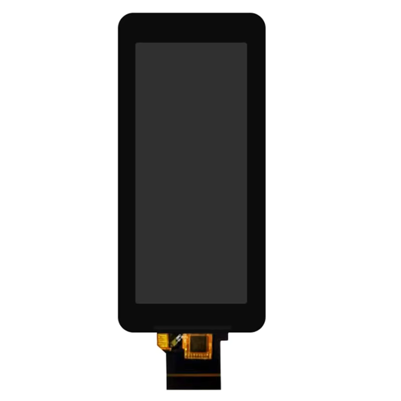

# ST7701 40-Pin 18-bit RGB Interface Pinout

These displays are much larger than the ST7789 and GC9A01 displays and are difficult if not impossible to drive efficiently with a microcontroller.
They come with a RGB interface, which unlike SPI, allows for a significant increase in speed and resolution as you can send the entire bit over a single clock cycle instead of sending a bit over multiple clock cycles as it is done with SPI.

If you are not familiar with the RGB interface, it is a parallel interface where you have multiple data lines (DB0-DB17) and a clock line (CLK).
This display in particular uses 18 bits per pixel and offers an additional data-enable, horizontal sync, and vertical sync lines.
In a way, this is a "digital VGA" interface, but without the need for analog signals to drive it.

## Specifications

Note that these are typical values and may vary from display to display.

| Parameter | Value |
|---|---|
| Working voltage | 2.8 to 3.3 V |
| LED current (max) | 20 mA | 
| LED forward voltage | 3.0 V |
| LED count | 24 |
| LED string length | 6 |
| Touch controller | GT911 |

## Pinout

| Pin | Name | Description |
| --- | --- | --- |
| 1 | LEDA | LED Anode |
| 2 | LEDK | LED Cathode |
| 3 | LEDK | LED Cathode |
| 4 | GND | |
| 5 | VCC | |
| 6 | bRST | Reset, active low |
| 7-8 | NC | Not connected |
| 9 | SDA | SPI data |
| 10 | SCL | SPI clock |
| 11 | CS | SPI chip select |
| 12 | DCLK | RGB dot clock |
| 13 | DE | RGB data enable |
| 14 | VSYNC | RGB vertical sync |
| 15 | HSYNC | RGB horizontal sync |
| 16-21 | DB0-DB5 | RGB data bit 0-5 (Blue) |
| 22-27 | DB6-11 | RGB data bit 6-11 (Green) |
| 28-33 | DB12-DB17 | RGB data bit 12-17 (Red) |
| 34 | GND | |
| 35 | TP_IRQ | Touch interrupt |
| 36 | TP_SDA | Touch I2C data |
| 37 | TP_SCL | Touch I2C clock |
| 38 | TP_RST | Touch reset |
| 39 | TP_VCC | Touch VDD |
| 40 | TP_GND | Tocuh GND |
