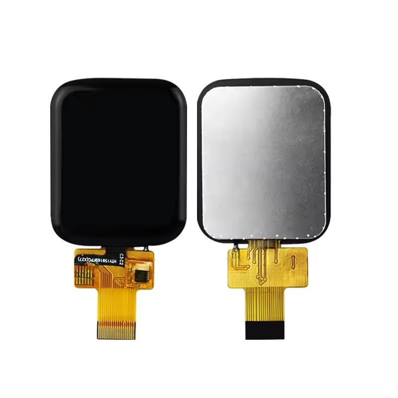

# ST7789 18-Pin 1-bit SPI Display with Touch Pinout

These displays are usually rectangular, and have a resolution of up to 240x320 pixels, although most are smaller than that.
Most common sizes are 1.47" and 1.69" where they come with resolutions of 172x320 and 240x280 respectively.

With a color depth of 16 to 18 bits per pixel, this gives a total of 65k to 262k colors, or more commonly known as RGB565 and RGB666.

## Specifications

Note that these are typical values and may vary from display to display.

| Parameter | Value |
|---|---|
| Working voltage | 2.8 to 3.3 V |
| LED current (max) | 20 mA | 
| LED forward voltage | 3.0 V |
| LED count | 3 |
| LED string length | 1 |
| Touch controller | CST816T |

## Pinout

| Pin | Name | Function |
|---|---|---|
| 1 | GND | |
| 2 | LEDK | LED cathode |
| 3 | LEDA | LED anode |
| 4 | VDD | |
| 5 | GND | |
| 6 | GND | |
| 7 | D/C | Data/Command select |
| 8 | CS | Chip select |
| 9 | SCL | SPI clock |
| 10 | SDA | SPI data |
| 11 | RESET | Reset |
| 12 | GND | |
| 13 | TP_SCL | Touch I2C clock |
| 14 | TP_SDA | Touch I2C data |
| 15 | TP_RST | Touch reset |
| 16 | TP_IRQ | Touch interrupt |
| 17 | TP_VDD | Touch VDD |
| 18 | TP_GND | Touch GND |
