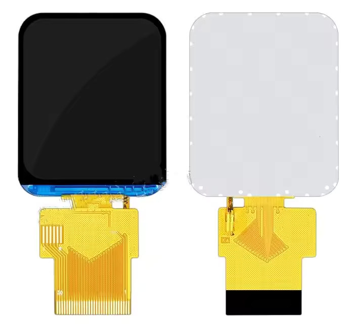

# ST7789 30-Pin 16-bit RGB Display Pinout

These displays are usually rectangular, and have a resolution of up to 240x320 pixels, although most are smaller than that.
With a color depth of 16 to 18 bits per pixel, this gives a total of 65k to 262k colors, or more commonly known as RGB565 and RGB666.

## Specifications

Note that these are typical values and may vary from display to display.

| Parameter | Value |
|---|---|
| Working voltage | 2.8 to 3.3 V |
| LED current (max) | 20 mA | 
| LED forward voltage | 3.0 V |
| LED count | 3 |
| LED string length | 1 |

## Pinout

| Pin | Name | Function |
|---|---|---|
| 1 | GND | |
| 2 | LEDA | LED anode |
| 3 | VDD | |
| 4 | IM0 | Interface mode 0 |
| 5 | RST | Reset |
| 6 | CS | Chip select |
| 7 | RS | Serial clock | 
| 8 | WR | Write input |
| 9 | RD | Read enable |
| 10-25 | DB0-DB15 | Data bit 0-15 |
| 16-30 | N/C | Not connected |