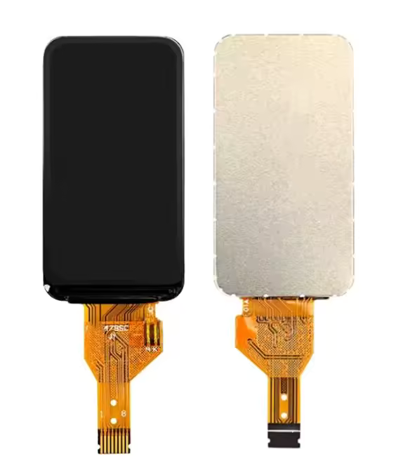

# ST7789 8-Pin 1-bit SPI Display Pinout

These displays are usually rectangular, and have a resolution of up to 240x320 pixels, although most are smaller than that.

With a color depth of 16 to 18 bits per pixel, this gives a total of 65k to 262k colors, or more commonly known as RGB565 and RGB666.

## Specifications

Note that these are typical values and may vary from display to display.

| Parameter | Value |
|---|---|
| Working voltage | 2.8 to 3.3 V |
| LED current (max) | 20 mA | 
| LED forward voltage | 3.0 V |
| LED count | 3 |
| LED string length | 1 |

## Pinout

| Pin | Name | Function |
|---|---|---|
| 1 | LEDA | LED anode |
| 2 | GND | |
| 3 | RST | Reset |
| 4 | D/C | Data/Command select |
| 5 | SDA | SPI data |
| 6 | SCL | SPI clock |
| 7 | VDD | |
| 8 | CS | SPI chip select |